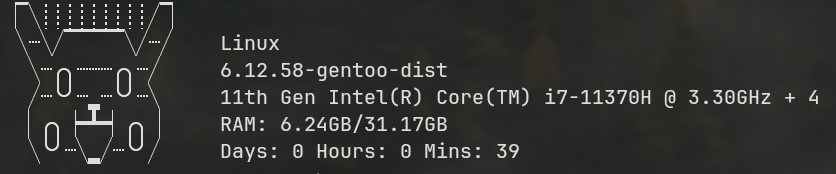

# Yet Another Fetch

A quick and simple Fetch program written in C.

Currently **only** works on Linux systems with an x86 CPU.
Support for Arm may come in the near future.

YAF grabs the following data:
- system name
- kernel version
- CPU & CPU cores
- RAM 
  - currently in use RAM / Total RAM
- Uptime
- Cool ASCII Pikachu

